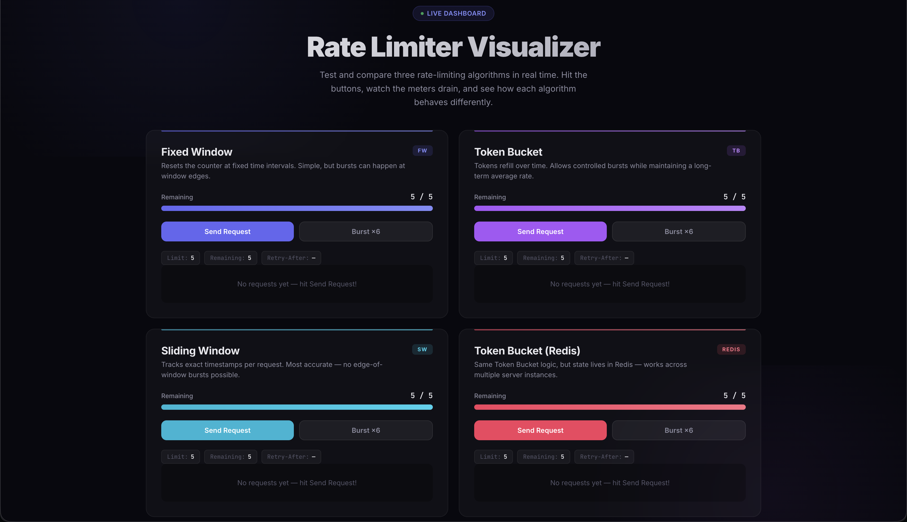
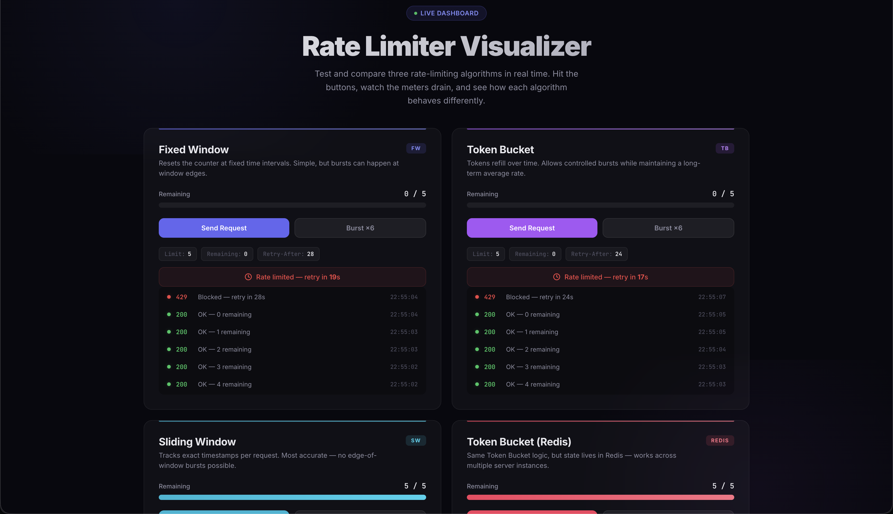

# 🛡️ RateCraft: A Multi-Algorithm Rate Limiter

Building a rate limiter is easy. Building one that doesn't frustrate users while keeping your server alive? That's the tricky part. 

**RateCraft** is a playground I built to visualize and compare three different rate-limiting strategies in real-time. It’s not just a set of middlewares—it comes with a live dashboard so you can see exactly how tokens refill, windows slide, and requests get blocked.

---

## 🚀 Why this project?

Most of us just npm install a rate limiter and forget about it. I wanted to dig deeper into the math and logic behind the scenes. This project implements:
- **The "Good Enough":** Fixed Window
- **The "Smooth Operator":** Token Bucket (In-Memory)
- **The "Precision Tool":** Sliding Window Log
- **The "Scale Ready":** Distributed Token Bucket (Powered by Redis)

## 🧠 The Algorithms Under the Hood

### 1. Fixed Window (The Simple One)
The most basic approach. You get X requests per Y minutes. Great for internal tools, but it can suffer from "bursting" at the edge of time windows.

### 2. Token Bucket (The Standard)
Think of it like a bucket that refills over time. You can burst up to the bucket's capacity, but if you're too fast, you have to wait for the next "drop" to arrive. It's the most flexible for general APIs.

### 3. Sliding Window Log (The Precise)
Instead of fixed slots, we track every single request timestamp. It’s the most accurate way to ensure a user never exceeds the limit in *any* rolling window, though it takes a bit more memory.

### 4. Distributed Token Bucket (Redis)
All the goodness of the Token Bucket, but synced across multiple server instances. Perfect for when your app grows beyond a single container.

---

## ⚡ Key Features

- **Live Visualization:** A custom-built dashboard that polls the server to show remaining tokens in real-time.
- **Header Injection:** Every response includes `X-RateLimit-Limit`, `X-RateLimit-Remaining`, and `X-RateLimit-Reset` headers.
- **Docker Ready:** Completely containerized and optimized for non-root security.
- **Hugging Face Optimized:** Built to run perfectly on HF Spaces with proxy-aware IP tracking.

## 🛠️ Tech Stack

- **Backend:** Node.js + Express
- **State:** Redis (via Upstash)
- **Styling:** Vanilla CSS (Glassmorphism design)
- **Deployment:** Docker + Hugging Face Spaces

---

## 📸 Interface Preview

  
  

---

## 🤝 Contributing
If you have a cooler algorithm (maybe a Sliding Window Counter?) or want to polish the UI, feel free to open a PR. I'm all ears!

---
*Built with ❤️ by Arunaksha*
